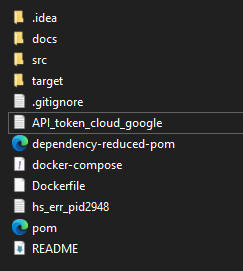
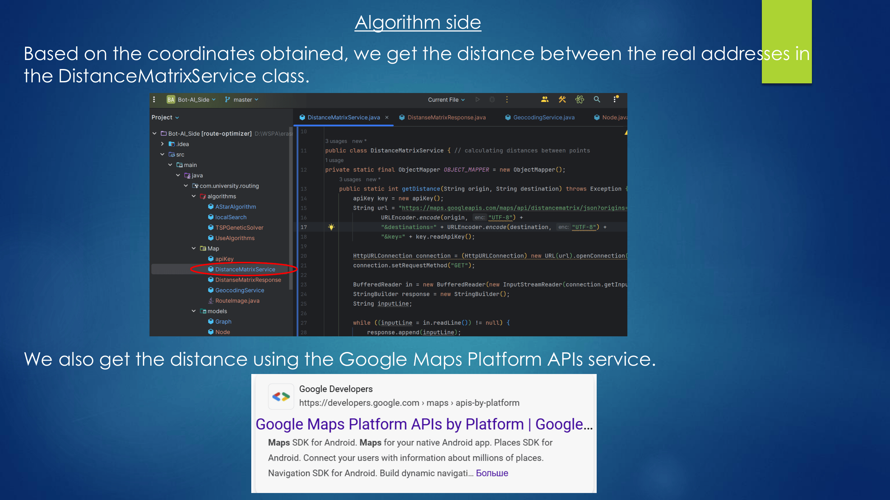
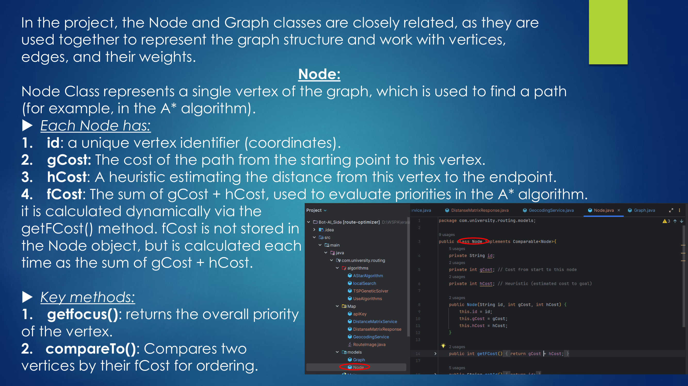
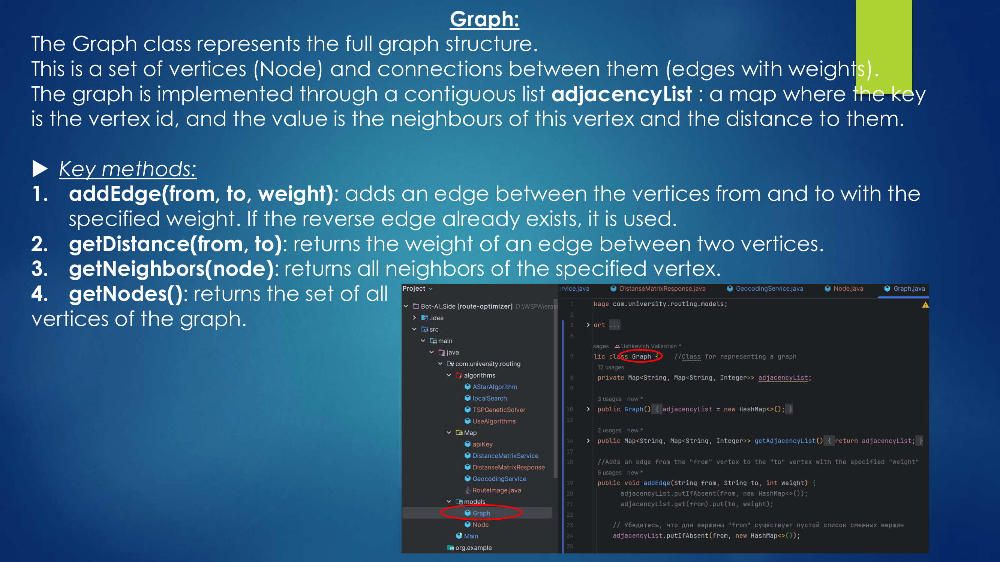
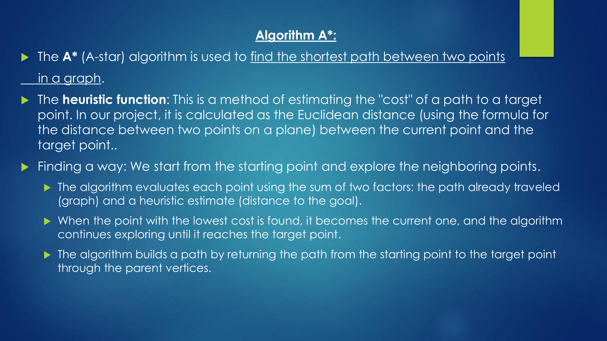
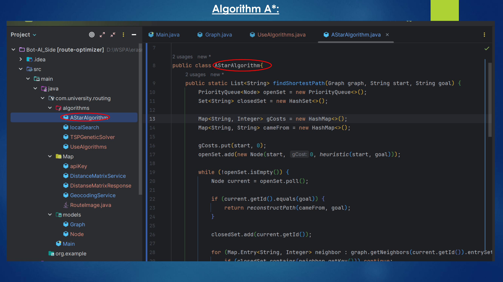
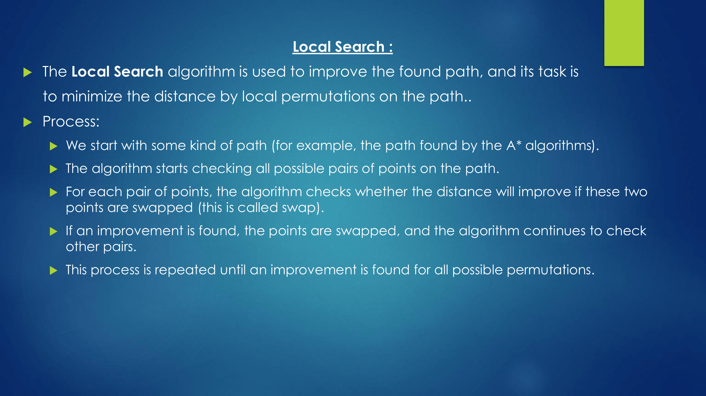
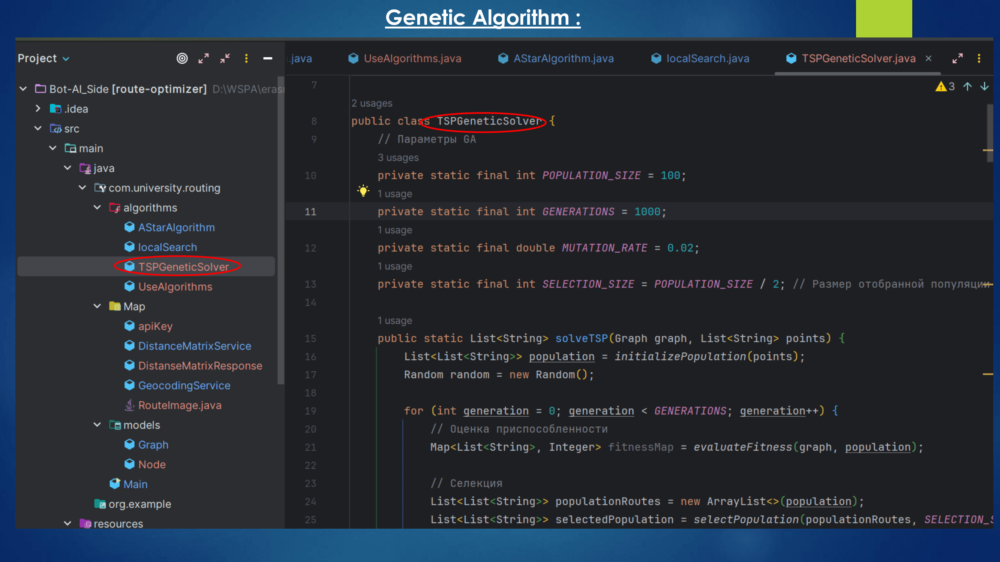
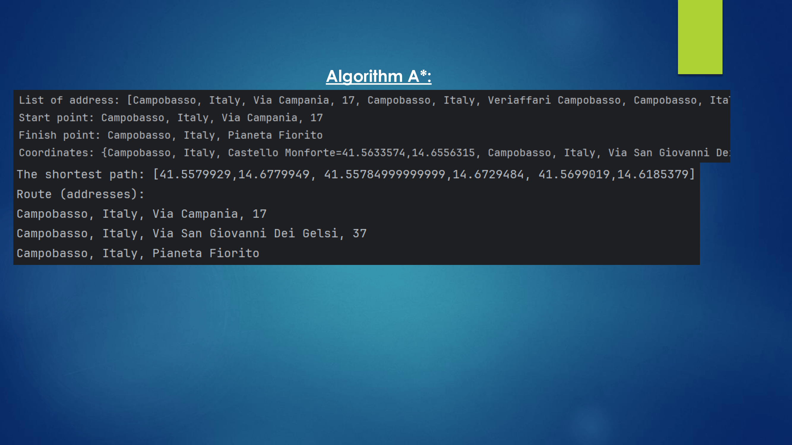
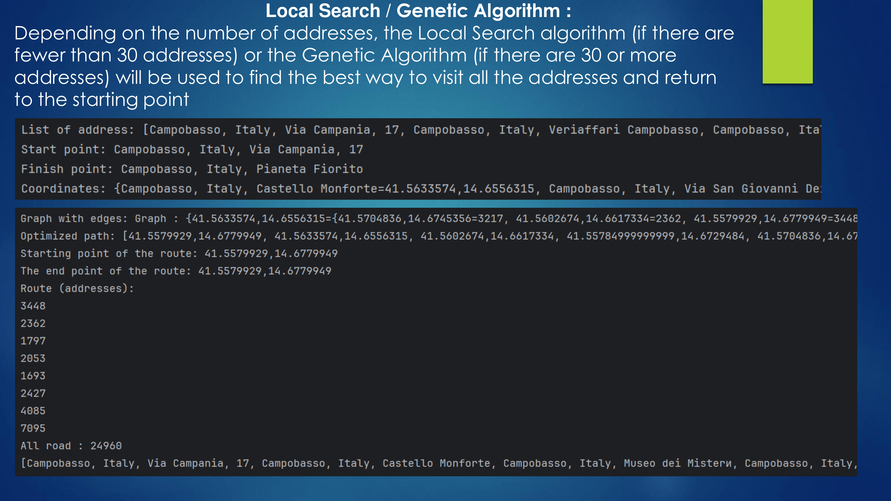

# A bot for finding the best way

## Description

This repository contains the server-side component of a chatbot, implementing algorithmic logic for route processing. The main functionality is to receive a list of points (places to visit) from a Telegram bot ( https://github.com/sierjo/Bot-TelegramSide ), obtain their coordinates using Google Cloud Maps, and build a graph where vertices represent points and edges represent distances between them.

The following algorithms are used to solve the optimal route problem:

- **Genetic Algorithm** — evolutionary search for optimal paths.
- **A*** (A-Star) — shortest path search algorithm in a graph.
- **Local Search** — a method for local improvement of solutions.

The project is written in pure Java 17 without using third-party libraries (except for the Google Cloud Maps API for obtaining coordinates).

Integration with the Telegram bot is planned for the future; currently, the server-side component works autonomously.

## Technologies

- Java 17
- Google Cloud Maps API
- Docker (for containerization)

## Project Structure

- Receiving a list of points from the Telegram bot ( https://github.com/sierjo/Bot-TelegramSide )
- Obtaining coordinates of points via Google Cloud Maps
- Building a graph with vertices and edges (distances)
- Route optimization using Genetic Algorithm, A*, and Local Search

## Running the Project

The project runs as a Java application. JDK 17 is required.

## 🚀 How to Run the Project

1.  **Clone the repository:**
    ```bash
    git clone https://github.com/rakets/Bot-AI_Side.git
    ```
2.  **Go to the project folder:**
    ```bash
    cd Bot-AI_Side
    ```
3.  **Add API google cloud maps token:**
    ```bash
    Create txt-file "API_token_cloud_google" and put token inside file.
    ```
    <a href="./docs/png/token.png">
    
    </a>
4.  **Build the project:**
    ```bash
    mvn clean install
    ```
5.  **Run the project:**
    ```bash
    java -jar target/route-optimizer-1.0-SNAPSHOT.jar
    ```

## Planned Improvements

- Integration with the Telegram bot for two-way communication ( https://github.com/sierjo/Bot-TelegramSide )
- Algorithm optimization

<p align="center">
  <a href="./docs/png/project-1.png">
    
  </a>
  <a href="./docs/png/project-2.png">
    
  </a>
  <a href="./docs/png/project-3.png">
    
  </a>
  <a href="./docs/png/project-4.png">
    
  </a>
  <a href="./docs/png/project-5.png">
    
  </a>
  <a href="./docs/png/project-6.png">
    
  </a>
  <a href="./docs/png/project-7.png">
    
  </a>
  <a href="./docs/png/project-8.png">
    
  </a>
  <a href="./docs/png/project-9.png">
    
  </a>
  <a href="./docs/png/project-10.png">
    
  </a>
  <a href="./docs/png/project-11.png">
    
  </a>
  <a href="./docs/png/project-12.png">
    
  </a>
  <a href="./docs/png/project-13.png">
    
  </a>
  <a href="./docs/png/project-14.png">
    
  </a>
  <a href="./docs/png/project-15.png">
    
  </a>
  <a href="./docs/png/project-16.png">
    
  </a>
  <a href="./docs/png/project-17.png">
    
  </a>
  <a href="./docs/png/project-18.png">
    
  </a>
  <a href="./docs/png/project-19.png">
    
  </a>
  <a href="./docs/png/project-20.png">
    
  </a>
  <a href="./docs/png/project-21.png">
    
  </a>
  <a href="./docs/png/project-22.png">
    
  </a>
</p>
